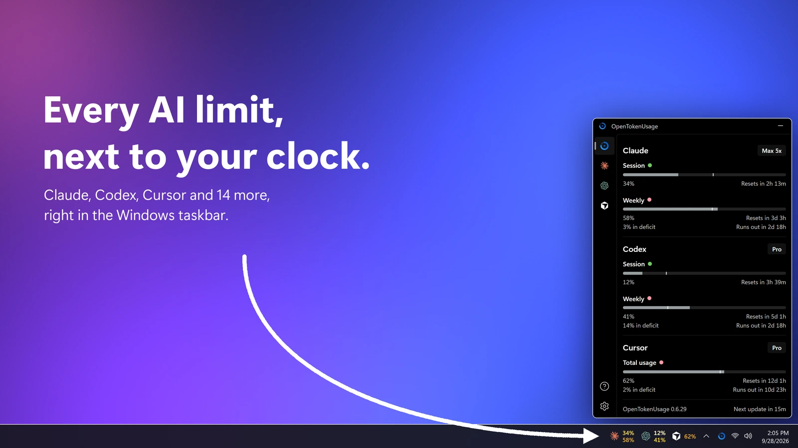
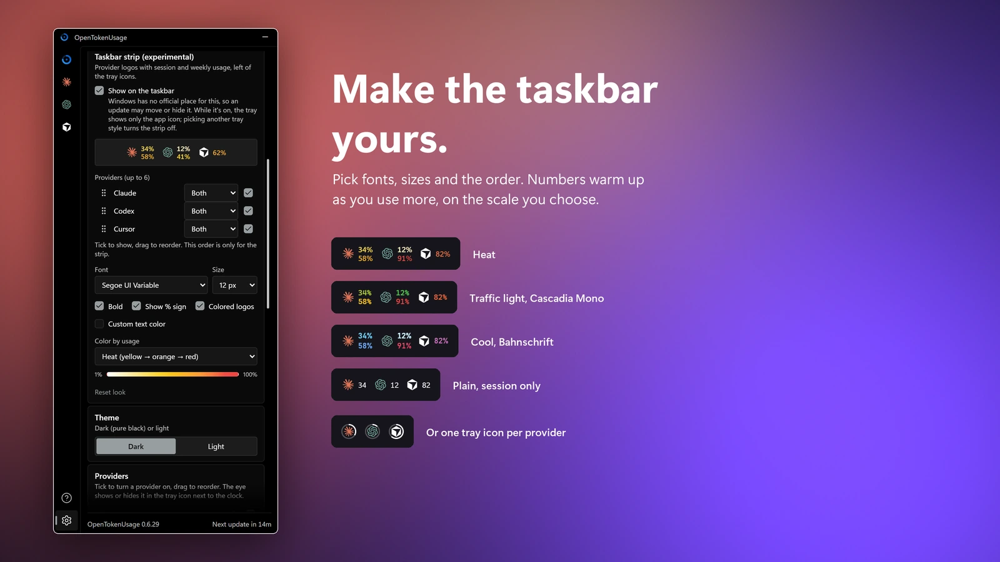
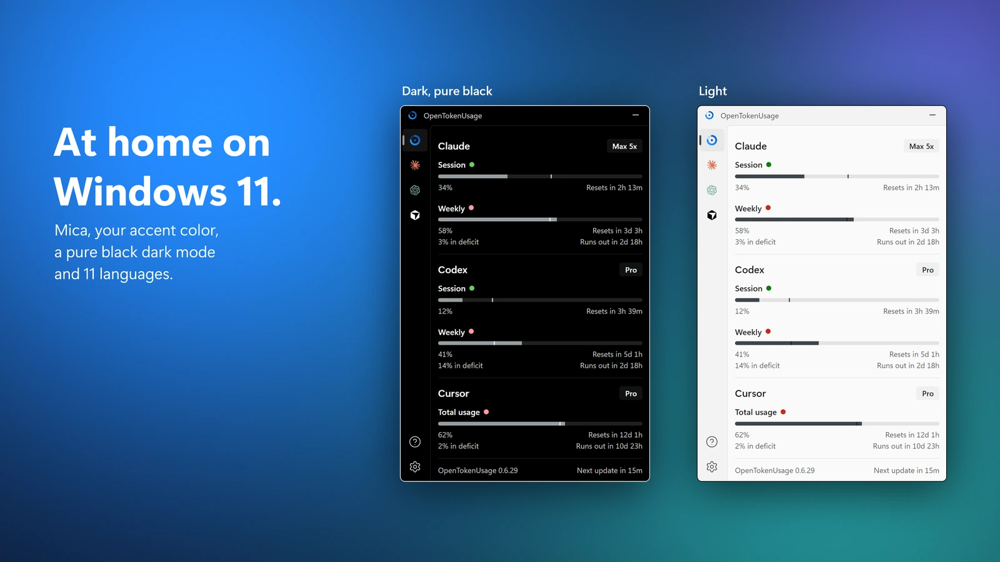

# OpenTokenUsage

Every AI coding limit, next to your clock. Made for **Windows 11** by [PowerUserZ](https://github.com/PowerUserZ). Website: [opentokenusage.app](https://opentokenusage.app)



OpenTokenUsage lives in the notification area and shows how much of your AI coding subscriptions you've used: session and weekly limits, credits, when they reset, and whether you're on pace. No digging through dashboards, no mental math.

## Download

**Install with [WinGet](https://learn.microsoft.com/windows/package-manager/winget/) (recommended):**

```powershell
winget install PowerUserZ.OpenTokenUsage
```

Or [**download the latest release**](https://github.com/PowerUserZ/OpenTokenUsage/releases/latest) and run the installer.

The app checks for new releases in-app and updates itself.

## What It Does

- **One glance.** All your AI tools in one panel, opened from the tray or a global shortcut. Pin it above other windows, or have it open where you left it.
- **Next to the clock.** The tray shows the app icon, a percent, bars, or one number or logo ring per provider.
- **Taskbar strip (experimental).** Provider logos with session and weekly usage right in the taskbar, in your own fonts, colors and order.
- **Pace.** Every limit says whether you're ahead or behind, and when it runs out at this rate.
- **Notifications.** At the usage levels you pick, when you're on pace to run out before a reset, and when a limit resets, with a built-in sound or your own.
- **One-click fixes.** Errors come with the fix: run the login command in a terminal, or open the provider's API key page and Windows' Environment Variables.
- **Service status.** A badge on the card when the provider's status page reports an incident.
- **Windows 11 native.** Mica, your accent color, a pure black dark theme and a light one.
- **11 languages.** English, Deutsch, Español (España and Latinoamérica), Français, Italiano, 日本語, 한국어, Português (Brasil), Türkçe and 简体中文.
- **Plugin-based.** Each provider is a small plugin, so adding one is easy. New providers arrive with app updates.
- **[Local HTTP API](docs/local-http-api.md).** Other apps on your PC can read your usage from `127.0.0.1:6736` (loopback only).
- **[Proxy support](docs/proxy.md).** Route provider requests through a SOCKS5 or HTTP proxy.

## Make It Yours



Settings → **Tray icon** picks what sits next to the clock. Settings → **Taskbar strip** puts logos with session and weekly numbers into the taskbar: choose up to 6 providers and their order, the font and size, and a color scale that warms up as you use more.

## At Home on Windows 11



## Supported Providers

- [**Amp**](docs/providers/amp.md) / free tier, bonus, credits
- [**Antigravity**](docs/providers/antigravity.md) / Gemini and Claude models, session and weekly
- [**Claude**](docs/providers/claude.md) / session, weekly, Fable, extra usage, rate limit resets, local token usage (ccusage)
- [**Codex**](docs/providers/codex.md) / session, weekly, reviews, credits
- [**Copilot**](docs/providers/copilot.md) / credits, extra usage, chat, completions
- [**Cursor**](docs/providers/cursor.md) / credits, total usage, requests, auto usage, API usage, Grok Bot, on-demand, bonus spend, CLI auth
- [**Factory / Droid**](docs/providers/factory.md) / standard, premium tokens
- [**Grok**](docs/providers/grok.md) / weekly limit, credits used, pay-as-you-go cap
- [**JetBrains AI Assistant**](docs/providers/jetbrains-ai-assistant.md) / quota, remaining
- [**Kiro**](docs/providers/kiro.md) / credits, bonus credits, overages
- [**Kimi Code**](docs/providers/kimi.md) / session, weekly
- [**MiniMax**](docs/providers/minimax.md) / coding plan session
- [**OpenCode Go**](docs/providers/opencode-go.md) / 5h, weekly, monthly usage limits
- [**Devin**](docs/providers/devin.md) / weekly and daily quota, extra usage
- [**Perplexity**](docs/providers/perplexity.md) / reads the Perplexity macOS app's session, so it doesn't work on Windows yet
- [**Synthetic**](docs/providers/synthetic.md) / 5-hour rate limit, subscription, tool calls, search
- [**Z.ai**](docs/providers/zai.md) / session, weekly, web searches

## Contributing

- **Add a provider.** Each one is just a plugin. See the [Plugin API](docs/plugins/api.md).
- **Fix a bug.** PRs welcome. Provide before/after screenshots.
- **Request a feature.** [Open an issue](https://github.com/PowerUserZ/OpenTokenUsage/issues/new) and make your case.

## License

[MIT](LICENSE)

---

<details>
<summary><strong>Build from source</strong></summary>

### Prerequisites

- [Rust](https://www.rust-lang.org/tools/install)
- [Bun](https://bun.sh)
- [Tauri 2 prerequisites](https://v2.tauri.app/start/prerequisites/)

### Steps

```bash
git clone https://github.com/PowerUserZ/OpenTokenUsage.git
cd OpenTokenUsage
bun install
bun tauri build
```

The built app will be in `src-tauri/target/release/bundle/`.

</details>

## Acknowledgments

OpenTokenUsage started as a fork of [OpenUsage](https://github.com/robinebers/openusage) by [Robin Ebers](https://itsbyrob.in/x) (MIT) and was rebuilt for Windows. It is not the official OpenUsage and is not affiliated with it. Inspired by [CodexBar](https://github.com/steipete/CodexBar) by [@steipete](https://github.com/steipete).
